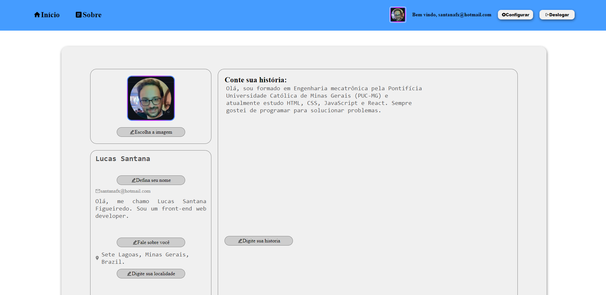
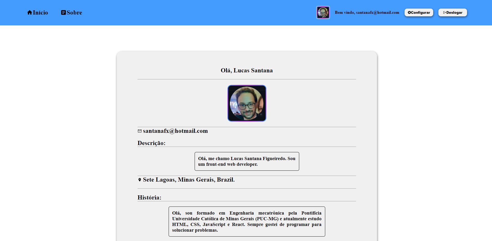
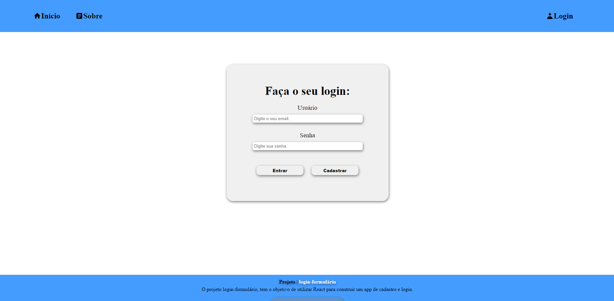
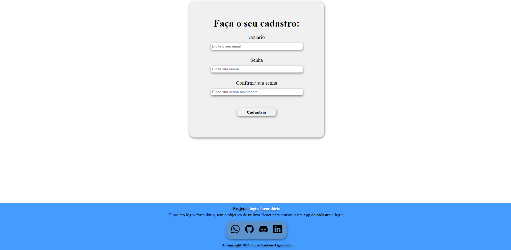

# Sobre o projeto

O projeto consistiu em criar um sistema de login, cadastro e atualização de informações do usuário. Quando a página é acessada, não existe nenhum usuário cadastrado ou logado, então, é necessário cadastrar um usuário. São feitos vários testes de validação para que o usuário cadastre seguindo um padrão desejado. Exemplo: tamanho mínimo de senha de 6 caracteres, tamanho máximo de senha de 10 caracteres, o usuário tem que ser em formato de email, etc. Uma vez que o usuário estiver logado, o menu de navegação fornece ao usuário opções de navegação (configurar e deslogar). Apertando o botão de configurar, é possível atualizar as informações do usuário. As informações do usuário, depois de cadastradas, irão aparecer também na página inicial. Caso o usuário queira deslogar e logar novamente, as informações são carregadas na página inicial sem precisar preencher novamente os campos da página de configuração.

## Acesse

<a href="https://login-formulario-be49-ett5j6s85-santanafx.vercel.app/">Acesse a aplicação clicando aqui</a>.

## Imagem do projeto

## Linguagens utilizadas

JavaScript | React | HTML | CSS

 
  
<!--    -->
  
  
  
<!--   
   -->

## Como instalar
